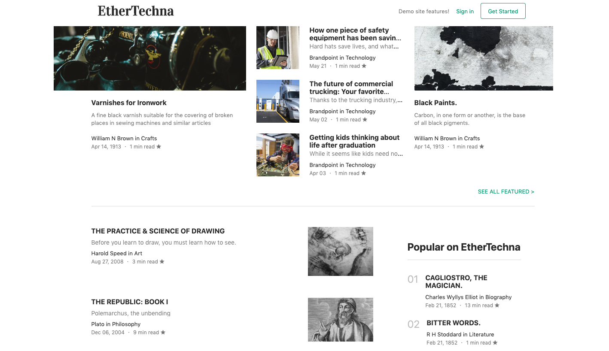
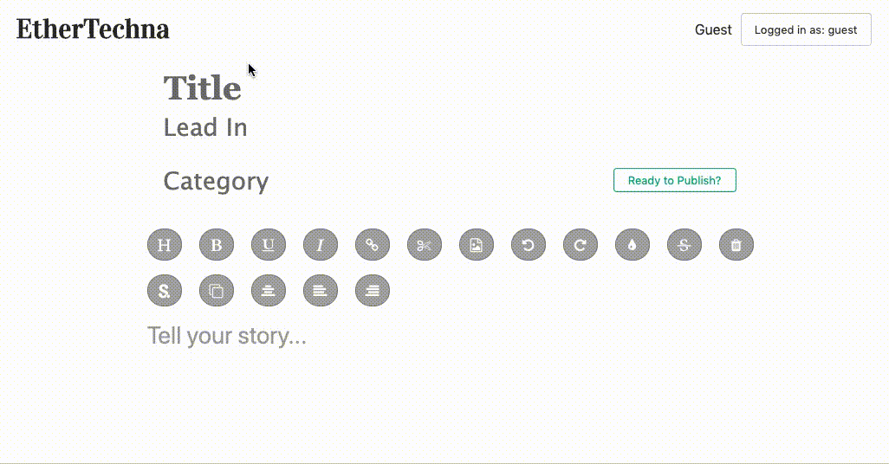

# **[EtherTechna](https://ethertechna.herokuapp.com/)**


It was once believed in the scientific community that the "Ether" existed as a medium connecting all objective mass in the universe, derived from the Greek god of divine air—Aether.  "Techna," also Greek in origin, refers to a skill, trade, art, or device of means.  'EtherTechna' then strives to connect artists, crafters, and ideas as a collaborative hub, sharing information and understanding.

EtherTechna launches into Social Journalism where every member is an author, contributor, and learner on subject matter that matters.  With content as the focal point, each user's composition is voted up in the form of 'claps.'  By being insightful, helpful, useful, or just generally interesting, readers give value and worth to articles democratically (i.e. the readers' objective votes determine the subjective quality of an author's work).  This mechanism provides great feedback to an authur, allowing her/him to gauge at a glance how their work is performing.

For further feedback, readers can also leave constructive 'responses' for an author.  This messaging element creates the *social* aspect of the site, encouraging interaction between authors and readers on a more coloquial level.

Live Site: [EtherTechna](https://ethertechna.herokuapp.com/)


# **Tech Basis**
<a href="https://www.ruby-lang.org/en/"></a><a href="https://rubyonrails.org/"></a><a href="https://reactjs.org/"></a><a href="https://redux.js.org/"></a>

Crated with Ruby on Rails, React, and Redux, this single page app strives to create a seemless, user-centric experience where content is easy to produce, update, and beautify.

#### The Main Page splashes guests with works from the various would-be and well-read authors:





#### The Editor is simple and easy to jump into:



#### The User Authorization modal is created via a React Presentational component

```
class Modal extends React.Component {
  constructor(props) {
    super(props)
    this.renderErrors = this.renderErrors.bind(this)
  }

  renderErrors() {
    const sessionErrors = this.props.errors.map((error, i) => {
      return <li key={`error-${i + 1}`}>{ error }</li>
    })

    return (
      <ul className="modal-form-error-container">
        { sessionErrors }    
      </ul>
    )
  }

  render () {
    const { modal, closeModal } = this.props
    if (!modal) return null
  
    let component
    switch (modal) {
      case 'login':
        component = <LoginForm />
        break
      case 'signup':
        component = <SignupForm />
        break
      default:
        return null
    }
    return (
      <div className="modal-background" onClick={ closeModal } >
        <div className={ `modal-child modal-${modal}` } onClick={ e => e.stopPropagation() } >
          { component }
        </div>
        <div>
          { this.renderErrors() }
        </div>
      </div>
    )
  }
}

export default Modal
```

Verifying global state via reducer:
```
import { OPEN_MODAL, CLOSE_MODAL } from '../actions/modal_actions'

const modalReducer = (state = null, action) => {
  Object.freeze(state)
  switch (action. type) {
    case OPEN_MODAL:
      return action.modal
    case CLOSE_MODAL:
      return null
    default:
      return state
  }
}

export default modalReducer
```